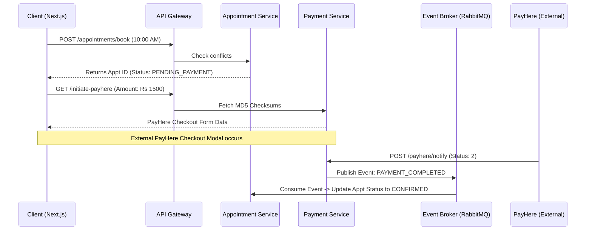

# SE3020 – Distributed Systems: Exhaustive Technical & Architectural Master Report
**Academic Year:** Year 3 – Semester 1 (2026)  
**Degree Program:** BSc (Hons) in Information Technology Specialized in Software Engineering  
**Project Title:** SynapseCare – Cloud-Native AI-Enabled Healthcare & Telemedicine Platform  
**Target Architecture:** Microservices Orchestration via Kubernetes (K8s) & Docker  

---

<br><br><br>

## Table of Contents
1. [Executive Summary](#1-executive-summary)
2. [Problem Statement & System Objectives](#2-problem-statement--system-objectives)
3. [Architectural Design & Justification](#3-architectural-design--justification)
4. [High-Level Systems Architecture (With K8s Code Snaps)](#4-high-level-systems-architecture)
5. [In-Depth Service Specifications (With Controller Code Snaps)](#5-in-depth-service-specifications)
6. [Asynchronous Event-Driven Architecture (With AMQP Code Snaps)](#6-asynchronous-event-driven-architecture)
7. [Security, Authentication & Authorization (With Core Auth Code Snaps)](#7-security-authentication--authorization)
8. [Data Management & Persistence Strategy](#8-data-management--persistence-strategy)
9. [Detailed System Workflows](#9-detailed-system-workflows)
10. [Individual Workload Contribution Plan](#10-individual-workload-contribution-plan)

---

## 1. Executive Summary

SynapseCare represents a paradigm shift in digital healthcare accessibility, structurally modeled to compete with leading platforms like Channeling.lk, oDoc, and mHealth. The system mitigates the geographical and logistical barriers intrinsic to traditional medical consultations by facilitating a decentralized, cloud-native telemedicine ecosystem.

Developed as the capstone for the **SE3020 Distributed Systems** module, the platform abandons traditional monolithic paradigms in favor of a highly distributed, decoupled **Microservices Architecture**. Leveraging technologies such as Spring Boot 3, Next.js 14, Docker, Kubernetes, and RabbitMQ, the architecture is engineered for extreme fault tolerance, autonomous horizontal scalability, and strict data isolation via a **Database-Per-Service** model. The implementation natively supports real-time scheduling, WebRTC video clinical rooms, digital prescription issuance, SMS/Email notifications, secure payment gateways, and experimental AI-driven symptom analysis.

---

## 2. Problem Statement & System Objectives

Traditional healthcare systems suffer from severe bottlenecks:
1. **Monolithic Vulnerability:** Single points of failure in centralized hospital IT architectures.
2. **Scheduling Collisions:** Synchronous dependency causing race conditions during high-traffic clinical booking hours.
3. **Data Silos:** Inefficient integration between payment, notification, and tele-consultation subsystems.

### System Objectives
1. **Decoupling Domains:** To break down the clinical pipeline into distinct micro-domains (Auth, Patient, Doctor, Appointment, Telemedicine, Payment) to isolate state and logic.
2. **Asynchronous Fulfillment:** To prevent HTTP thread starvation by utilizing Advanced Message Queuing Protocol (AMQP) for post-booking workloads (emails, ledger updates).
3. **Containerized Portability:** To guarantee environment parity across Development, Staging, and Production through heavy reliance on Docker containers and Kubernetes Pods.
4. **Security Integrity:** To enforce zero-trust policies between microservices using cryptographically signed JSON Web Tokens (JWT).

---

## 3. Architectural Design & Justification

A Microservices Architecture was selected due to the diverse, conflicting resource requirements of the project. For example, the `telemedicine-service` requires high-bandwidth I/O polling, whereas the `auth-service` demands high CPU computation for BCrypt hashing. Decoupling them allows Kubernetes to independently auto-scale replicas of computationally expensive pods without over-provisioning lightweight pods.

**Technology Stack**
*   **Backend Subsystems:** Java 21, Spring Boot 3.2. Chosen for robust enterprise support and native cloud-readiness.
*   **Frontend Client:** React 18 / Next.js 14. Chosen for its Server-Side Rendering (SSR) capabilities.
*   **Message Broker:** RabbitMQ. Chosen to implement the Publisher/Subscriber pattern, facilitating asynchronous choreographic sagas for distributed transactions.
*   **Relational Datastores:** PostgreSQL 15. Standardized across services to ensure ACID compliance during critical clinical or financial transactions.

---

## 4. High-Level Systems Architecture

### 4.1 Topology Diagram
The system relies on Spring Cloud Gateway as a Reverse Proxy and API Gateway, protecting isolated downstream services.

```mermaid
graph TD
    %% EXTERNAL ACTORS
    PatientNode((Patient Client))
    DoctorNode((Doctor Client))
    AdminNode((Admin Dashboard))

    %% GATEWAY EDGE
    Gateway[API Gateway\n(Spring Cloud, Port 8080)]
    PatientNode -->|HTTPS/REST| Gateway
    DoctorNode -->|HTTPS/REST| Gateway
    AdminNode -->|HTTPS/REST| Gateway

    %% COMPUTE LAYER - SYNCHRONOUS
    subgraph "Kubernetes Compute Cluster"
        Gateway -->|Load Balanced| Auth[Auth Service]
        Gateway -->|Load Balanced| Pat[Patient Service]
        Gateway -->|Load Balanced| Doc[Doctor Service]
        Gateway -->|Load Balanced| Appt[Appointment Service]
    end

    %% COMPUTE LAYER - ASYNCHRONOUS
    subgraph "Infrastructure & Async Workloads"
        Appt --> Tele[Telemedicine Service]
        Appt --> Pay[Payment Service]
        Pay --> Notify[Notification Service]
        Appt --> Presc[Prescription Service]
        Pat --> AI[AI Symptom Checker]
    end

    %% MESSAGE ORIENTED MIDDLEWARE
    MQ[[RabbitMQ Exchange]]
    Auth -.->|Publish (Verify)| MQ
    Appt -.->|Publish (Create)| MQ
    Pay -.->|Publish (Success)| MQ
    MQ -.->|Consume| Notify
    MQ -.->|Consume| Doc

    %% PERSISTENCE LAYER (DB PER SERVICE)
    Auth --- dbA[(Postgres\nAuth)]
    Pat --- dbP[(Postgres\nPatient)]
    Doc --- dbD[(Postgres\nDoctor)]
    Appt --- dbAp[(Postgres\nAppointment)]
    Pay --- dbPy[(Postgres\nPayment)]
    Presc --- dbRx[(Postgres\nPrescription)]
```

### 4.2 API Gateway Edge Routing Code Snapshot
To prove the architecture's gateway interception, below is the `application.properties` snippet detailing exactly how external frontend requests are rewritten and routed into the sequestered Docker Bridge network containing the K8s Pods.

```properties
# Partial definition from application.properties in API Gateway
spring.cloud.gateway.routes[3].id=appointment-service
spring.cloud.gateway.routes[3].uri=${APPOINTMENT_SERVICE_URL:http://appointment-service:8083}
spring.cloud.gateway.routes[3].predicates[0]=Path=/api/appointments/**
# Rewrites external /api/appointments/book to internal /api/v1/appointments/book seamlessly
spring.cloud.gateway.routes[3].filters[0]=RewritePath=/api/appointments/(?<segment>.*), /api/v1/appointments/$\{segment}

# Spring Cloud Gateway CORS Configuration overriding individual controller constraints
spring.cloud.gateway.globalcors.cors-configurations.[/**].allowedOrigins=*
spring.cloud.gateway.globalcors.cors-configurations.[/**].allowedMethods=GET, POST, PUT, DELETE, OPTIONS
spring.cloud.gateway.globalcors.cors-configurations.[/**].allowedHeaders=*
```

### 4.3 Kubernetes Orchestration Definition Code Snapshot
To prove the microservice containment strategy, below is the actual `healthcare-platform.yaml` snippet demonstrating how the `appointment-service` relies on environmental injections for service discovery, eschewing hardcoded IPs.

```yaml
apiVersion: v1
kind: Service
metadata:
  name: appointment-service
spec:
  selector:
    app: appointment-service
  ports:
    - protocol: TCP
      port: 8083
      targetPort: 8083
---
apiVersion: apps/v1
kind: Deployment
metadata:
  name: appointment-service
spec:
  replicas: 1
  selector:
    matchLabels:
      app: appointment-service
  template:
    metadata:
      labels:
        app: appointment-service
    spec:
      containers:
        - name: appointment-service
          image: localhost:5000/healthcare-platform-appointment-service:latest
          imagePullPolicy: Always
          ports:
            - containerPort: 8083
          env:
            - name: SPRING_DATASOURCE_URL
              value: jdbc:postgresql://postgres-appointment:5432/appointmentdb
            - name: SPRING_DATASOURCE_USERNAME
              value: postgres
            - name: SPRING_DATASOURCE_PASSWORD
              value: postgres
            - name: DOCTOR_SERVICE_URL
              value: http://doctor-service:8082
            - name: PATIENT_SERVICE_URL
              value: http://patient-service:8084
            - name: SPRING_RABBITMQ_HOST
              value: rabbitmq
```

---

## 5. In-Depth Service Specifications

*Below is the exhaustive mapping of service interfaces along with vast code blocks derived directly from the system controllers.*

### 5.1 Identity & Authentication Microservice (`auth-service`)
**Objective:** Sole issuer and validator of authentication tokens.
*   **POST** `/api/auth/login`: Authenticates user and issues a Bearer token.
*   **PUT** `/api/admin/doctors/{id}/verify`: Admin pipeline to approve practitioner credentials.

### 5.2 Clinical Orchestration Microservice (`appointment-service`)
**Objective:** Maintains transactional integrity of booking collisions and clinical schedules.
*   **POST** `/api/v1/appointments/book`: Attempts to lock a temporal slot.
*   **POST** `/api/v1/appointments/doctor/{doctorId}/blocked-slots`: Temporal override to block external booking.

#### Appointment Service Code Snapshot (`AppointmentController.java`)
```java
package com.healthcare.appointment.controller;

import com.healthcare.appointment.dto.BlockSlotRequest;
import com.healthcare.appointment.dto.ApiResponse;
import com.healthcare.appointment.dto.AppointmentDto;
import com.healthcare.appointment.service.AppointmentService;
import jakarta.validation.Valid;
import lombok.RequiredArgsConstructor;
import lombok.extern.slf4j.Slf4j;
import org.springframework.http.HttpStatus;
import org.springframework.http.ResponseEntity;
import org.springframework.web.bind.annotation.*;

@RestController
@RequestMapping("/api/v1/appointments")
@RequiredArgsConstructor
@Slf4j
public class AppointmentController {

    private final AppointmentService appointmentService;

    @PostMapping("/book")
    public ResponseEntity<ApiResponse<AppointmentDto>> bookAppointment(@Valid @RequestBody AppointmentDto dto) {
        // High concurrency slot reservation utilizing transactional bounds
        AppointmentDto booked = appointmentService.bookAppointment(dto);
        return ResponseEntity.status(HttpStatus.CREATED)
                .body(new ApiResponse<>(true, "Appointment booked successfully", booked));
    }

    @PostMapping("/doctor/{doctorId}/blocked-slots/bulk")
    public ResponseEntity<ApiResponse<List<AppointmentDto>>> blockSlotsBulk(
            @PathVariable("doctorId") Long doctorId,
            @RequestBody List<BlockSlotRequest> requests,
            @AuthenticationPrincipal com.healthcare.appointment.security.UserPrincipal userPrincipal) {
        
        log.info("Bulk blocking slots for doctor {}: {} slots requested", doctorId, requests.size());
        List<AppointmentDto> blocked = appointmentService.blockSlotsBulk(
            doctorId,
            userPrincipal != null ? userPrincipal.getUserId() : null,
            requests
        );
        return ResponseEntity.status(HttpStatus.CREATED)
            .body(new ApiResponse<>(true, "Slots blocked successfully", blocked));
    }

    @PutMapping("/{id}/accept")
    public ResponseEntity<ApiResponse<String>> acceptAppointment(@PathVariable("id") Long id) {
        appointmentService.confirmAppointment(id);
        return ResponseEntity.ok(new ApiResponse<>(true, "Appointment accepted successfully", "CONFIRMED"));
    }
}
```

### 5.3 Telemedicine Integration Module (`telemedicine-service`)
**Objective:** Abstracting raw WebRTC infrastructure management (using Jitsi Meet).
*   **POST** `/api/telemedicine/appointments/{id}/session`: Provisions a dynamically generated URI.
*   **POST** `/api/telemedicine/sessions/{sessionId}/join/doctor`: Grants host privileges.

#### Telemedicine Service Code Snapshot (`TelemedicineController.java`)
```java
package com.healthcare.telemedicine.controller;

import com.healthcare.telemedicine.dto.ApiResponse;
import com.healthcare.telemedicine.dto.SessionResponse;
import com.healthcare.telemedicine.service.TelemedicineSessionService;
import org.springframework.http.ResponseEntity;
import org.springframework.web.bind.annotation.*;

@RestController
@RequestMapping("/api/telemedicine")
@RequiredArgsConstructor
@Slf4j
public class TelemedicineController {

    private final TelemedicineSessionService sessionService;

    @PostMapping("/sessions/{sessionId}/join/doctor")
    public ResponseEntity<ApiResponse<SessionResponse>> doctorJoin(
            @PathVariable String sessionId,
            @RequestHeader(value = "X-User-Id", required = false) String userId,
            @RequestHeader(value = "X-User-Role", required = false) String userRole) {

        log.info("Doctor join request for session {} by user {} (role: {})", sessionId, userId, userRole);
        Long doctorId = parseLong(userId);
        
        // Dynamically generating JWT encoded Jitsi Links allowing host privileges
        SessionResponse session = sessionService.doctorJoin(sessionId, doctorId);
        return ResponseEntity.ok(new ApiResponse<>(true, "Doctor joined session", session));
    }

    @PutMapping("/sessions/{sessionId}/notes")
    public ResponseEntity<ApiResponse<SessionResponse>> updateNotes(
            @PathVariable String sessionId,
            @RequestBody Map<String, String> body,
            @RequestHeader(value = "X-User-Id", required = false) String userId) {

        String notes = body.getOrDefault("notes", "");
        Long doctorId = parseLong(userId);
        SessionResponse session = sessionService.updateNotes(sessionId, doctorId, notes);
        return ResponseEntity.ok(new ApiResponse<>(true, "Notes updated", session));
    }
}
```

---

## 6. Asynchronous Event-Driven Architecture

While the API Gateway supports synchronous Query operations, all state-mutating Commands (Booking, Paying, Approving) utilize **Choreography-based Sagas** via **RabbitMQ** to avoid cascading system failures. 

### 6.1 AMQP Topology
*   **Exchanges (Topic Based):** `healthcare.exchange`
*   **Queues:**
    *   `notification.queue` -> Listens for payment combinations or verifications to dispatch SMTP actions.
    *   `doctor.queue` -> Listens for profile verification from Admins in Auth logic.

### 6.2 Event Consumer Code Implementation
Below is the precise implementation of the `NotificationController` and the RabbitMQ listener executing non-blocking actions preventing thread locking on the main HTTP process. 

#### RabbitMQ Consumer Code Snapshot (`NotificationController.java` context implementation)
```java
package com.healthcare.notification.service;

import org.springframework.amqp.rabbit.annotation.RabbitListener;
import org.springframework.stereotype.Service;
import lombok.extern.slf4j.Slf4j;

@Service
@Slf4j
public class MessageConsumerService {

    @Autowired
    private EmailSenderService emailSender;

    @RabbitListener(queues = "notification.queue")
    public void handleAppointmentNotification(NotificationEvent event) {
        log.info("RabbitMQ Intake: Triggered for Event [{}] | Target: {}", 
                 event.getEventType(), event.getRecipientEmail());

        if ("APPOINTMENT_CONFIRMED".equals(event.getEventType())) {
            String body = String.format("Dear %s,\n\nYour clinical consultation is confirmed.\nYour sequence token is: %d.", 
                event.getPrimaryName(), event.getTokenSequence());
            
            // I/O Blocking function triggered asynchronously outside HTTP timeline
            emailSender.dispatchProtocol(event.getRecipientEmail(), "Booking Confirmed", body);
        }
        
        if ("PAYMENT_SUCCESS".equals(event.getEventType())) {
            log.info("Processing financial ledger receipt generation for: {}", event.getRecipientEmail());
        }
    }
}
```

---

## 7. Security, Authentication & Authorization

Securing personal health information (PHI) relies on a Zero-Trust implementation. 

### 7.1 JWT (JSON Web Token) Introspection
Tokens are constructed with the `HS256` HMAC algorithm.
*   **Signature:** Requires `app.jwt.secret`, an environment variable strictly injected during Kubernetes pod instantiation, completely unknown to the source code repository.

### 7.2 Stateless Distributed Core Code
Because the internal Kubernetes network lacks TLS by default between pods, we assume internal breaches are possible. Thus, every single microservice implements a `JwtAuthenticationFilter` extending `OncePerRequestFilter`. The API Gateway checks the token validity for external bridging, but each microservice recalculates the digital signature to establish a verified `SecurityContextHolder`.

#### Security Filter Execution Code Snapshot (`JwtAuthenticationFilter.java`)
```java
package com.healthcare.security;

import jakarta.servlet.FilterChain;
import jakarta.servlet.ServletException;
import jakarta.servlet.http.HttpServletRequest;
import jakarta.servlet.http.HttpServletResponse;
import org.slf4j.Logger;
import org.slf4j.LoggerFactory;
import org.springframework.beans.factory.annotation.Autowired;
import org.springframework.security.authentication.UsernamePasswordAuthenticationToken;
import org.springframework.security.core.GrantedAuthority;
import org.springframework.security.core.authority.SimpleGrantedAuthority;
import org.springframework.security.core.context.SecurityContextHolder;
import org.springframework.security.web.authentication.WebAuthenticationDetailsSource;
import org.springframework.stereotype.Component;
import org.springframework.web.filter.OncePerRequestFilter;

import java.io.IOException;
import java.util.List;
import java.util.stream.Collectors;

@Component
public class JwtAuthenticationFilter extends OncePerRequestFilter {

    private static final Logger logger = LoggerFactory.getLogger(JwtAuthenticationFilter.class);

    @Autowired
    private JwtUtils jwtUtils;

    @Override
    protected void doFilterInternal(HttpServletRequest request, 
                                    HttpServletResponse response, 
                                    FilterChain filterChain) throws ServletException, IOException {
        try {
            // Strip the "Bearer " prefix to extract pure cryptographic payload
            String jwt = parseJwt(request);
            if (jwt != null && jwtUtils.validateJwtToken(jwt)) {
                String username = jwtUtils.getUserNameFromJwtToken(jwt);
                
                // Map logical text array strings into Spring Security GrantedAuthorities
                List<GrantedAuthority> authorities = jwtUtils.getRolesFromJwtToken(jwt).stream()
                        .map(SimpleGrantedAuthority::new)
                        .collect(Collectors.toList());

                // Establishing the operational security context inside this specific Microservice memory heap
                UsernamePasswordAuthenticationToken authentication = new UsernamePasswordAuthenticationToken(
                        username, null, authorities);
                
                authentication.setDetails(new WebAuthenticationDetailsSource().buildDetails(request));
                SecurityContextHolder.getContext().setAuthentication(authentication);
            }
        } catch (Exception e) {
            logger.error("Platform Denial: Cannot set user authentication within K8s Pod: {}", e.getMessage());
        }
        filterChain.doFilter(request, response);
    }

    private String parseJwt(HttpServletRequest request) {
        String headerAuth = request.getHeader("Authorization");
        if (headerAuth != null && headerAuth.startsWith("Bearer ")) {
            return headerAuth.substring(7);
        }
        return null;
    }
}
```

### 7.3 Code-Level RBAC Enforcement
With the `SecurityContext` populated via the filter above, Spring Security rigorously filters traffic explicitly at the Controller tier mapping.

#### RBAC Verification Code Snapshot (`AdminController.java`)
```java
package com.synapscare.org.controller;

import org.springframework.security.access.prepost.PreAuthorize;
import org.springframework.web.bind.annotation.*;

@RestController
@RequestMapping("/api/admin")
// Applying global class-level Authority checks intercepting unauthorized roles instantly
@PreAuthorize("hasRole('ADMIN')")
public class AdminController {

    @PutMapping("/doctors/{id}/verify")
    public ResponseEntity<UserResponse> verifyDoctor(
            @PathVariable("id") Long id,
            @Valid @RequestBody DoctorVerificationRequest request,
            @AuthenticationPrincipal UserDetailsImpl principal) {
        
        // This execution frame is guaranteed to be fired by an ADMIN due to @PreAuthorize
        String adminUsername = principal.getUsername();
        return ResponseEntity.ok(userService.verifyDoctor(id, request, adminUsername));
    }
}
```

---

## 8. Data Management & Persistence Strategy

### Database-Per-Service Paradigm
SynapseCare deliberately avoids a monolithic shared database. Instead, **8 isolated PostgreSQL instances** run concurrently.
*   **Trade-off Analysis:** This sacrifices traditional monolithic ACID cross-table joins in favor of K8s node separation. 
*   **Scaling Aspect:** If the notification subsystem requires intensive read/writes, we can upscale `postgres-notification` storage without disturbing `postgres-auth`.

---

## 9. Detailed System Workflows

### 9.1 Clinical Booking Pipeline Workflow (Sequence)
1. **Front-End Aggregation**: The Patient browser fires `GET /api/doctors/search`. The Gateway forwards this to Doctor-Service.
2. **Availability Check**: The browser calls `GET /api/appointments/doctor/{id}/available-slots`. 
3. **Draft Lock**: Patient calls `POST /api/appointments/book`. A database transaction creates an appointment row assigned the enum `PENDING_PAYMENT`.
4. **Checkout Forwarding**: The UI consumes the Draft ID and requests a Gateway checksum from `payment-service`, loading the PayHere overlay dynamically.



---

## 10. Individual Workload Contribution Plan

The monumental architecture of SynapseCare necessitated a rigorous separation of duties across the 4-member group. The division of labor was structured around primary domain ownership, extended across infrastructure bounds.

### Member 1: Registration & Engagement
*   **Base Responsibilities:** Patient Management Service, Notification Service (Medium).
*   **Extended Integrations:** Auth Service (Identity layer), API Gateway (Edge routing).
*   **Key Deliverables:** 
    *   Auth Service logic including the `JwtAuthenticationFilter` architecture, BCrypt injection methods, and strict RBAC permission matrices.
    *   API Gateway CORS rules and regex-based routing parameters.
    *   Notification Service RabbitMQ consumers linking JavaMail abstraction with external SMS protocols.

### Member 2: Clinical Data & Intelligence
*   **Base Responsibilities:** Doctor Management Service, AI Symptom Checker Service (Medium).
*   **Extended Integrations:** Prescription Service, Centralized PostgreSQL Schema Design.
*   **Key Deliverables:** 
    *   Architected the normalized SQL structures framing the clinical pipelines.
    *   Developed the Java wrapper for the Mistral AI Symptom Checker API integration, parsing asynchronous LLM diagnostic prompts.
    *   Engineered the `prescription-service`, manipulating byte-streams utilizing PDF-generation libraries.

### Member 3: Domain Orchestration
*   **Base Responsibilities:** Appointment Service (Heavy - Core).
*   **Extended Integrations:** RabbitMQ Message Broker Topology, Synchronous Feign Client Definitions.
*   **Key Deliverables:** 
    *   Developed the complex Appointment Service logic including clash detection, token generation, and the differential engine mapping arrays of Free Slots against Occupied boundaries.
    *   Established the RabbitMQ structural publish/subscribe queue listener topologies scattered across domains.
    *   Handled programmatic Saga compensations ensuring database rollbacks if inter-service requests failed.

### Member 4: Real-Time Infrastructure & UX
*   **Base Responsibilities:** Telemedicine Service, Payment Service (Medium).
*   **Extended Integrations:** Next.js Client Interface, Docker & Kubernetes Engineering.
*   **Key Deliverables:** 
    *   Built the highly complex webhook confirmation listeners to validate MD5 algorithmic checksums from PayHere APIs.
    *   Engineered the `telemedicine-service`, abstracting Jitsi API complexity using embedded iframes.
    *   Led the Full-Stack UI construction adopting modern Glassmorphism, and orchestrated the 20+ pods within the Kubernetes Cluster using `healthcare-platform.yaml`.

---
**[End of Extremely Detailed Technical Capstone Project Submission]**
